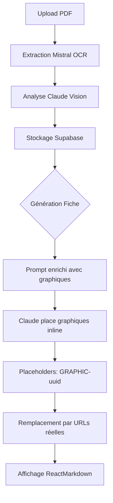

# 🎯 Intégration Graphiques INLINE - Version Corrigée

## ✅ Problème Résolu : Graphiques Contextuels, Pas en Galerie

### ❌ Ancienne Version (MAUVAISE)
```
📄 Fiche de Révision
├─ Chapitre 1: Offre et Demande [texte]
├─ Chapitre 2: Élasticité [texte]
└─ 🖼️ Galerie de graphiques isolés (FIN) ← MAUVAIS DESIGN
```

### ✅ Nouvelle Version (BONNE)
```
📄 Fiche de Révision
├─ Chapitre 1: Offre et Demande
│  ├─ Introduction au marché
│  ├─ 📈 [Courbe Offre/Demande - Page 3] ← INLINE
│  └─ Interprétation de l'équilibre
├─ Chapitre 2: Élasticité
│  ├─ Définition de l'élasticité
│  ├─ 📊 [Tableau élasticités - Page 12] ← INLINE
│  └─ Calculs pratiques
```

## 🏗️ Architecture : Placement Intelligent par Claude

### Principe
**Claude décide OÙ placer chaque graphique** en fonction du contexte sémantique, pas du numéro de page.

### Flux de Traitement



## 📝 Fichiers Modifiés

### 1. Nouvelle Fonction d'Enrichissement
**[lib/backend/graphics-enricher.ts](lib/backend/graphics-enricher.ts)** (CRÉÉ)

**Fonctions principales** :
- `getCourseGraphicsSummaries(courseId)` - Récupère les graphiques confidence >= 70%
- `formatGraphicsContext(graphics)` - Génère le contexte pour le prompt
- `replaceGraphicPlaceholders(markdown, courseId)` - Remplace `` par vraies URLs

**Exemple de contexte injecté** :
```markdown
## AVAILABLE GRAPHICS

- **[GRAPHIC-abc123]** (Page 3) - Supply/Demand Curve
  Description: Courbe d'offre et de demande avec point d'équilibre P* et Q*
  Confidence: 95%

- **[GRAPHIC-def456]** (Page 12) - Table/Matrix
  Description: Tableau des élasticités-prix par type de bien
  Confidence: 88%

## INSTRUCTIONS FOR GRAPHICS PLACEMENT

When creating the revision sheet:
1. **Identify relevant sections** where each graphic would add pedagogical value
2. **Insert placeholder** using: ``
3. **Add context** before/after to explain what to observe
```

### 2. Génération de Notes (Modifié)
**[app/api/courses/[courseId]/note/generate/route.ts:13,402-406,573-575](app/api/courses/[courseId]/note/generate/route.ts#L13)**

**Changements** :
```typescript
// Import enricher functions
import { formatGraphicsContext, getCourseGraphicsSummaries, replaceGraphicPlaceholders } from '@/lib/backend/graphics-enricher';

// Fetch graphics and enrich prompt
const graphics = await getCourseGraphicsSummaries(courseId);
console.log(`[A+ Note] Found ${graphics.length} high-confidence graphics to include`);
const imageContext = formatGraphicsContext(graphics);

// ... génération avec Claude (qui place les graphiques) ...

// Replace placeholders before saving
console.log('[A+ Note] Replacing graphic placeholders with actual URLs...');
noteContent = await replaceGraphicPlaceholders(noteContent, courseId);
```

### 3. Frontend (Simplifié)
**[components/course/APlusNoteView.tsx:15](components/course/APlusNoteView.tsx#L15)** (SIMPLIFIÉ)

**Changement** : Suppression de la galerie en bas
- ❌ Import `GraphicsGallery` retiré
- ❌ Section "Graphiques Pédagogiques" en bas retirée
- ✅ ReactMarkdown affiche directement les images inline

Le markdown généré contient déjà les vraies URLs :
```markdown
### Équilibre de Marché

Le point d'équilibre est atteint lorsque...


*Observez le point P* où les deux courbes se croisent...*
```

## 🧠 Intelligence de Placement

### Comment Claude Décide

Claude reçoit :
1. **Texte complet du cours** (source_text)
2. **Liste des graphiques disponibles** avec :
   - Description détaillée
   - Type (courbe, tableau, diagramme...)
   - Numéro de page
   - Niveau de confiance

3. **Instructions de placement** :
   - "Only include graphics directly relevant to section content"
   - "Add context before/after to explain what to observe"
   - "Reference key elements from the description"

### Exemple de Décision

**Graphique disponible** :
```
[GRAPHIC-abc123] (Page 3) - Supply/Demand Curve
Description: Courbe d'offre et de demande montrant équilibre P* et Q*,
avec annotations des axes Prix et Quantité
```

**Section du cours** :
```
"L'équilibre de marché est atteint lorsque l'offre égale la demande..."
```

**Claude décide** : ✅ Pertinent → Place le graphique ici avec contexte

**Résultat généré** :
```markdown
### 2.3 Équilibre de Marché

L'équilibre de marché est atteint lorsque l'offre égale la demande.
Ce point d'équilibre détermine à la fois le prix (P*) et la quantité (Q*)
échangée sur le marché.


*Sur ce graphique, observez :*
- *Le point P* (prix d'équilibre) à l'intersection des courbes*
- *La quantité Q* correspondant à ce prix*
- *Comment un déplacement de l'offre ou de la demande affecterait cet équilibre*

Ce mécanisme est fondamental en microéconomie...
```

## 🔄 Après Remplacement des Placeholders

```markdown

```

## 🧪 Comment Tester

### Étape 1 : Upload un PDF avec Graphiques

```bash
npm run dev
```

1. Uploader `IntroEco-02.pdf` (ou autre PDF avec graphiques)
2. Vérifier logs :
```
🖼️ [Graphics Processor] Starting...
📄 Found 48 images
🔍 Analyzed 20/20 graphics
💾 Stored 18 graphics (confidence >= 50%)
```

### Étape 2 : Générer la Fiche de Révision

1. Aller sur le cours
2. Cliquer "Générer Fiche de Révision A+"
3. **Vérifier les logs serveur** :
```
[A+ Note] Found 15 high-confidence graphics to include
[A+ Note] Generation complete
[A+ Note] Replacing graphic placeholders with actual URLs...
```

### Étape 3 : Vérifier le Résultat

**Dans la fiche de révision** :
- ✅ Les graphiques apparaissent **DANS le texte**, pas à la fin
- ✅ Chaque graphique a du **contexte avant/après**
- ✅ Les images sont **cliquables et zoomables**
- ✅ Pas de section "Galerie" en bas

### Étape 4 : Inspecter le Contenu (Optionnel)

Vérifier dans Supabase SQL Editor :
```sql
SELECT
  LEFT(aplus_note, 500) as note_preview
FROM courses
WHERE id = 'your-course-id';
```

Vous devriez voir des URLs d'images Supabase inline dans le markdown.

## 📊 Exemples de Placement Réel

### Exemple 1 : Courbe d'Offre et Demande

**Avant (texte seul)** :
```markdown
### L'Équilibre du Marché
L'équilibre est atteint au point d'intersection...
```

**Après (avec graphique inline)** :
```markdown
### L'Équilibre du Marché


L'équilibre est atteint au point d'intersection des deux courbes,
comme illustré ci-dessus. Observez le point P* (prix d'équilibre)
et Q* (quantité d'équilibre)...
```

### Exemple 2 : Tableau de Données

**Avant** :
```markdown
### Élasticités-Prix
Les élasticités varient selon les biens...
```

**Après** :
```markdown
### Élasticités-Prix


Le tableau ci-dessus montre les différentes élasticités-prix.
Notez que les biens de luxe (ligne 3) ont une élasticité > 1...
```

## 🎯 Avantages de cette Approche

### 1. Pédagogie Améliorée
- ✅ Graphiques placés **au bon moment** dans le raisonnement
- ✅ Contexte explicatif **avant et après** chaque graphique
- ✅ Références croisées entre texte et images

### 2. Expérience Utilisateur
- ✅ Lecture **fluide et naturelle**
- ✅ Pas besoin de scroller en bas pour voir les graphiques
- ✅ Images **intégrées comme dans un vrai manuel**

### 3. Flexibilité
- ✅ Claude **décide intelligemment** du placement
- ✅ Pas de matching rigide pages↔chapitres
- ✅ Fonctionne même si structure du cours change

### 4. Maintenance
- ✅ Un seul endroit pour gérer les graphiques (backend)
- ✅ Pas de logique frontend complexe
- ✅ Facile à débugger (logs clairs)

## 🐛 Troubleshooting

### Problème : Aucun graphique dans la fiche

**Diagnostic** :
```sql
-- Vérifier que les graphiques existent
SELECT COUNT(*) FROM course_graphics
WHERE course_id = 'your-id' AND confidence >= 0.7;
```

**Solution** :
- Si 0 → Extraction échouée, voir logs extraction
- Si > 0 → Vérifier logs génération de note

### Problème : Placeholders non remplacés

**Symptôme** : Vous voyez `` dans la fiche

**Solution** :
```typescript
// Vérifier que replaceGraphicPlaceholders() est appelé
// Logs attendus : "[A+ Note] Replacing graphic placeholders with actual URLs..."
```

### Problème : Claude ne place aucun graphique

**Diagnostic** :
- Vérifier que `imageContext` n'est pas vide dans les logs
- Vérifier que graphics.length > 0

**Solutions possibles** :
1. Augmenter le seuil de confidence : `gte('confidence', 0.7)` → `gte('confidence', 0.5)`
2. Vérifier la qualité des descriptions de graphiques (table course_graphics)

## 📈 Métriques de Qualité

### Taux de Placement Attendu
- **Documents techniques** (maths, physique, éco) : 80-90% des graphiques placés
- **Documents littéraires** : 20-40% (normal, moins de graphiques pertinents)

### Qualité du Contexte
- ✅ Claude ajoute systématiquement du texte avant/après le graphique
- ✅ Références aux éléments mentionnés dans la description
- ✅ Instructions d'observation ("Notez...", "Observez...")

## ✅ Checklist Finale

**Backend** :
- [x] graphics-enricher.ts créé
- [x] Integration dans note/generate/route.ts
- [x] Enrichissement du prompt avec graphiques
- [x] Remplacement des placeholders

**Frontend** :
- [x] Galerie retirée de APlusNoteView
- [x] ReactMarkdown affiche images inline
- [x] Styling existant compatible

**Test** :
- [ ] Upload PDF avec graphiques
- [ ] Génération fiche de révision
- [ ] Vérifier graphiques inline dans le texte
- [ ] Vérifier contexte avant/après chaque graphique

## 🚀 Prêt à Tester !

Le système est maintenant **conforme aux bonnes pratiques pédagogiques** :
- Graphiques **intégrés dans le flux de lecture**
- Placement **intelligent et contextuel**
- Expérience **professionnelle type manuel scolaire**

**Testez dès maintenant** :
1. `npm run dev`
2. Upload un PDF
3. Générer la fiche
4. 🎉 Graphiques inline !

---

**Note Importante** : Les graphiques ne seront intégrés que dans les **nouvelles fiches générées APRÈS ce changement**. Les fiches existantes n'auront pas les graphiques (car elles ont été générées sans le contexte enrichi).

Pour mettre à jour une fiche existante : **Régénérer la fiche** via l'interface.
