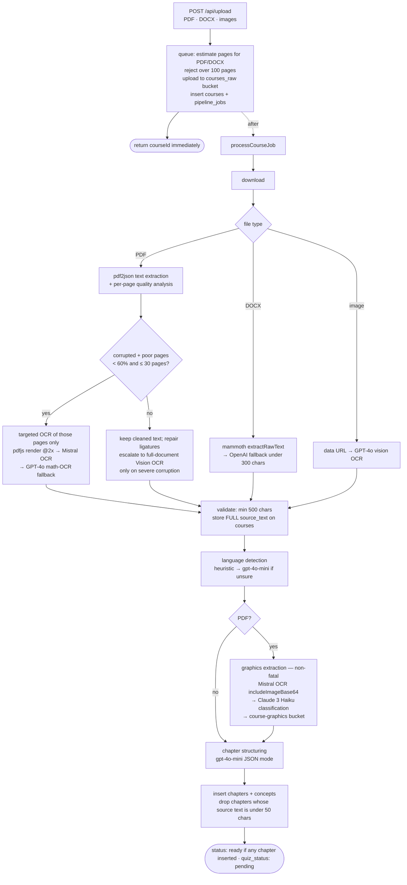

<p align="center">
  
</p>

<h1 align="center">Nareo</h1>

<p align="center">Turn a course PDF into a revision sheet, a quiz and a flashcard deck — in one upload.</p>

<p align="center"><em>Built in 48 hours at the Hack the Gap hackathon (Paris, November 2025) — 50+ users during the event, 3rd place.</em></p>

---

Nareo takes a student's own material — a lecture PDF, a DOCX, a stack of phone photos of handwritten notes — and returns a structured course: chapters, an exam-grade revision sheet with the original diagrams reinserted in the right places, a configurable quiz, and a spaced-repetition deck. Aristo, the tutor mascot, fronts the experience.

The interesting part is not the UI. It is that documents are hostile input: PDFs with broken math fonts, slide decks that are 90% diagrams and 10% text, scans with no text layer at all. Everything downstream — chapter structure, question grounding, figure placement — depends on getting reliable structure out of that mess. Most of this README is about that pipeline; the rest covers the schema, the app shell, setup, and an honest inventory of what is broken.

The core was built in a 48-hour hackathon and has been iterated on since, with real users on it throughout. That origin is worth keeping in mind while reading: the document pipeline got the hours, and the seams called out in [Known state](#known-state) — no test runner, layered RLS policies, a scatter of dead routes — are the debt a 48-hour build accrues and pays down over time, documented rather than hidden.

<p align="center">
  
</p>

**Three things to know before you read further:** there is no test runner and no CI — `npm test` does not exist, and what stands in for a suite is 32 manually-run smoke scripts that hit a local dev server and print pass/fail to the console without ever exiting non-zero; 28 of the 98 API route handlers use the Supabase service-role client and therefore bypass RLS; and `tailwind.config.ts` is dead code under Tailwind v4, so `prose` classes on the legal and blog pages render unstyled. The full inventory is in [Known state](#known-state).

## Contents

[Stack](#stack) · [Document pipeline](#document-pipeline) · [Model routing](#model-routing) · [Data model](#data-model) · [Application architecture](#application-architecture) · [Product surface](#product-surface) · [Getting started](#getting-started) · [Known state](#known-state)

---

## Stack

One Next.js application on Vercel, with Supabase (Postgres, Auth, Storage, Realtime) covering data, auth, file storage and realtime updates. There is no ORM and no queue broker — long-running generation jobs are tracked with status columns in Postgres and streamed to the client over SSE. Application logic runs as Next.js route handlers; third-party services cover payments (Stripe), transactional email (Resend), analytics (PostHog) and model inference (OpenAI, Anthropic, Mistral). The deliberate trade is fewer moving parts against writing raw SQL and owning row-level security by hand.

| Layer | Choice | Notes |
|---|---|---|
| Framework | Next.js `16.1.1` (declared `^16.0.7`), App Router only | 36 pages, 26 layouts, 99 route files (98 under `app/api/`) exporting 126 HTTP handlers. No `pages/`, no `middleware.ts` |
| UI | React `^19.2.0` (lockfile `19.2.3`), TypeScript `5.9.3` (`strict`) | `moduleResolution: bundler`, path alias `@/*` |
| Styling | Tailwind v4 (`4.1.18` resolved, `^4.1.17` declared) | `@import "tailwindcss"` in `app/globals.css`; the legacy `tailwind.config.ts` is **not** loaded — v4 requires an explicit `@config`, and none is present |
| State | React Context (4 providers, plus a non-context PostHog wrapper) + 33 hooks across 22 modules | No store library at runtime; `zustand` is a declared but unused dependency |
| Backend | 98 App Router route handlers under `app/api/` | Zero Server Actions; a few client components (friends, session tracking, editor) write to Supabase directly rather than through a route |
| Data | Supabase Postgres, 33 raw SQL migration files | No ORM; database interfaces are hand-written in `types/database.types.ts`, not generated |
| Auth | Supabase Auth via `@supabase/ssr` | Email/password + Google OAuth; PKCE is the `@supabase/ssr` default rather than an explicit configuration |
| Billing | Stripe `20.x`; apiVersion set per route (`2025-12-15.clover` in payments, `2025-11-17.acacia` in subscriptions) | 9,99 €/mo or 83,88 €/yr; entitlements granted by a signature-verified webhook |
| Analytics | PostHog, client-side, consent-gated | Opts out automatically in development |
| Deploy | Vercel | `vercel.json` sets `maxDuration: 300` for upload and course-level quiz generation |

**Rendering is client-heavy, and that is a decision rather than an accident.** 202 of the 425 TypeScript source files under `app/`, `components/`, `contexts/`, `hooks/`, `lib/` and `types/` carry `'use client'`, including 32 of 36 pages and all 147 components; the 26 layouts stay server components and exist mostly to emit metadata, with the root layout also injecting Organization and WebSite JSON-LD. Nearly every screen is an authenticated, highly interactive view over per-user data with no meaningful cache reuse, so the server-rendering budget buys little — the SEO-relevant pages (landing, blog, auth, legal) are the minority, and the work goes into the 98 route handlers instead.

---

## Document pipeline

Upload is synchronous only up to persistence. `POST /api/upload` validates, stores the raw file, inserts `courses` + `pipeline_jobs` rows, schedules the job inside Next's `after()` and returns a `courseId` immediately. Everything after that is a background stage machine writing progress into `pipeline_jobs.stage`, which the client follows over a Supabase Realtime subscription while independently polling every 2 s; note and flashcard generation stream their own progress over SSE.

<p align="center">
  
</p>



Quizzes, revision sheets and flashcards are **not** produced here. The job stops at `ready`; each artifact is generated on demand from a separate route.

### Why it is shaped this way

**Nothing expensive happens at upload time.** Upload stays fast, and — more importantly — the user configures the quiz before any tokens are spent on it, rather than receiving a default one and regenerating.

**Extraction is quality-aware, not all-or-nothing.** `parsePDFWithPages` returns full text *and* a per-page array from a single parse (pdf.js detaches the underlying `ArrayBuffer` once the document is loaded, so re-loading per page is avoided), then scores each page. Two failure modes are detected separately: pages with mangled math fonts (`corruptedPages`), and graphics-heavy pages with almost no extractable text (`poorPages`). If the damaged set is under 60% of the document and at most 30 pages, only those pages are re-rendered and OCR'd, then spliced back into the page array. Otherwise the cleaned text is kept as-is or ligature-repaired; full-document OCR is a last resort reached only when severe corruption survives that, because it is slow and expensive and most PDFs only have a handful of bad pages.

**OCR has a fallback chain, and the fallback is prompt-specialised.** Pages are rendered with `pdfjs-dist` (legacy build) onto a node canvas at 2× scale, sent to `mistral-ocr-latest` when a `MISTRAL` key is configured, and on failure or absence to a GPT-4o pass whose system prompt is tuned for mathematics — it forbids LaTeX output and requires Unicode sub/superscripts, because downstream markdown rendering is more reliable with literal Unicode than with half-escaped LaTeX from a vision model.

**Figures are extracted by the OCR model, not by re-rendering the PDF.** Mistral OCR called with `includeImageBase64: true` returns embedded figures as base64 alongside the page markdown. Figure extraction is its own stage rather than a byproduct of text extraction: the PDF is re-downloaded from storage and given a separate OCR call whose text output is discarded, and only the returned images are used. This replaced a page-by-page render-and-crop approach that hit detached-ArrayBuffer failures and was substantially slower; the old helper is still in the tree, unused. The stage is PDF-only and wrapped in try/catch, and its processor is lazily `import()`ed inside it: if vision fails, the course still reaches `ready` without figures. It also runs *after* language detection, so vision-generated descriptions come back in the document's own language.

Figure analysis runs on Claude 3 Haiku by default (`visionProvider`, switchable to GPT-4o), batched 20-wide with a 100 ms inter-batch delay, rejecting results below 0.3 confidence or with no detected elements — except for priority graphic types, which are kept regardless of confidence. It is deliberately open-ended: migration `029_update_graphic_types.sql` drops the `graphic_type` CHECK constraint that originally allowed five French labels, because the constraint blocked type detection for physics, chemistry, biology, CS and geography material. The TypeScript union now enumerates 36 types, keeping the original five for backward compatibility.

Language detection reads a 4k-char heuristic window and escalates to `gpt-4o-mini` on a 3k-char sample only when that heuristic is unsure, but `courses.source_text` is persisted untruncated — the revision-sheet generator needs the whole document later. The per-chapter and per-concept copies are truncated (8,000 and 2,000 characters respectively).

---

## Model routing

Three providers, chosen per task rather than by default loyalty.

| Task | Model | Rationale |
|---|---|---|
| PDF/image OCR, figure extraction | Mistral `mistral-ocr-latest` | Returns text and embedded images in one call; falls back to page-by-page GPT-4o vision when `MISTRAL` is unset |
| Quiz generation, fact extraction, semantic validation | Mistral `mistral-small-latest` | High call volume, structured JSON output |
| Figure classification | Anthropic `claude-3-haiku-20240307` | Cheapest adequate vision model for a per-image batch job |
| Language detection, chapter structuring, sheet structure/verification/synthesis, chapter flashcards | OpenAI `gpt-4o-mini` | Cheap JSON-mode reasoning |
| Section transcription, course flashcards, tutor chat, answer grading, image OCR (configurable `vision` model) | OpenAI `gpt-4o` | Where transcription fidelity matters |
| Voice input | OpenAI `whisper-1` | Tutor chat voice capture; transcription language is currently hardcoded to English |

LLM *utilities* are re-exported from the `lib/llm` barrel: retry with exponential backoff, LRU caching, circuit breakers, contextual fallbacks, and structured logging with token accounting. The provider clients (`lib/openai*.ts`, `lib/mistral-*.ts`, `lib/anthropic-vision.ts`) and the prompt templates in `lib/prompts/` sit outside that barrel and are imported directly.

### Question generation is grounded, then validated

Quiz generation does not simply ask a model for questions. Verifiable facts are extracted from the chapter first and injected into the prompt, which instructs the model to base each `source_reference` on them — a prompt-level constraint, not an enforced one: the runtime validator only checks that a `source_reference` is 15–300 characters and downgrades failures to warnings. Generated questions then pass a deterministic rule validator (length, four unique non-empty options, valid answer index) and a Jaccard-similarity deduplication pass (0.65 within a chapter, 0.70 for the course-level `CourseDeduplicationTracker`, which suppresses near-verbatim repeats across chapters within a single generation request). An LLM-based semantic validation stage exists but is disabled at every call site. Quizzes default to multiple-choice only; true-false and fill-in-the-blank are opt-in, alongside volume, chapter-vs-global scope, and an exclude-already-seen toggle that currently applies to global scope only.

### The revision sheet is a multi-pass pipeline

Documents over 15,000 characters take four passes: structure extraction (`gpt-4o-mini`) → per-section transcription (`gpt-4o`) → completeness verification → final synthesis, plus optional glossary and recaps. Shorter documents take a single `gpt-4o` pass. Prompt generations are mixed rather than centrally switched: the multi-pass and single-pass modules are V2-era, the active revision-sheet prompts (built on seven principles of active memorization) live in `lib/prompts/excellent-revision-v3.ts`, and further V4–V6 behaviour is hardcoded inline in the note routes. A leftover `const USE_V3 = true` gates the older path in `note/generate` only; the streaming route calls the V3 prompts unconditionally.

**Figure placement is deterministic, not LLM-chosen.** On the multi-pass path, each structure section carries a page range; the graphics map assigns figures to sections, and only that section's pre-assigned figures — with resolved Supabase public URLs — are formatted into its prompt, so the model emits inline `` markdown at the pedagogically right moment. It never decides *which* figures exist. (Documents under 15,000 characters take the single-pass path, where the full figure list goes into one prompt.) Figures are gated on confidence before reaching a prompt (≥0.5 for priority chart types, ≥0.7 otherwise), deduplicated across same-type candidates by description similarity keeping the highest-confidence copy, and filled up to an adaptive per-document limit clamped between 2 and 5 per section. A no-URL `` placeholder path survives as a fallback and a legacy regex branch, with the server rewriting surviving placeholders to real storage URLs after generation.

This inline-placement design replaced a bottom-of-page figure gallery, because inline figures preserve reading flow with explanatory context on both sides and page-proximity assignment degrades gracefully when the source document's structure does not map cleanly onto chapters. The residue of that reversal is still in the tree: `components/course/GraphicsGallery.tsx` is imported by nothing and is a candidate for deletion.

---

## Data model

Supabase Postgres. `database/migrations/` holds 33 files, numbered non-linearly (no `001`, no `018`–`020`, two competing `005` files, two different `026` files, plus an unnumbered `add-subscription-tier.sql`). They are applied by hand — there is no migration CLI, no migration tracking table and no ORM.

```
auth.users
 ├─ profiles                subscription_tier, stripe_customer_id, monthly_upload_count, locale
 ├─ courses                 status pending|processing|ready|failed, language, coverage ratios,
 │   │                      source_file_path, full source_text, aplus_note + note_* generation state
 │   ├─ chapters            status incl. pending_quiz; truncated source_text
 │   │   ├─ concepts
 │   │   └─ questions ─── question_concepts ─── concepts
 │   ├─ course_graphics     jsonb elements/suggestions, confidence, page number
 │   └─ flashcards ─── flashcard_progress   simplified SM-2: ease_factor, interval_days, review_count
 ├─ folders ─── folder_courses ─── courses
 ├─ gamification            daily_activity · user_gamification · badges · user_badges
 │                          xp_transactions · chapter_mastery · weekly_insights · user_rewards
 ├─ social                  user_profiles (friend_code) · friendships · weekly_points
 ├─ multiplayer             challenges · challenge_players · challenge_questions · challenge_answers
 └─ sessions                sessions · study_sessions · flashcard_sessions · priority_items

user-scoped ops             pipeline_jobs · log_events · payments · user_question_history
```

The revision sheet is stored on `courses` itself (`aplus_note` plus the `note_status`/`note_progress`/`note_partial_content` columns), not in a separate table; a `course_notes` table exists from migration `006` but is legacy and referenced by no application code. `flashcards` holds card content only — the scheduling state (`ease_factor`, `interval_days`, `next_review_at`, `review_count`) lives on `flashcard_progress`, and the scheduler is an SM-2-inspired three-button algorithm rather than textbook SM-2.

Streaks, badge awards, XP accrual and daily-goal calculation live in Postgres, but mostly as `SECURITY DEFINER` functions that API routes invoke over `supabase.rpc()` (`check_and_update_streak`, `record_quiz_answer_with_xp`, `update_chapter_mastery`, `calculate_daily_goal`); only badge checks and one streak-update path run on actual triggers. `lib/stats/utils.ts` and `lib/scoring.ts` still hold TypeScript reimplementations of the daily-goal and badge rules whose constants have drifted from the SQL. `delete_course_cascade` is `SECURITY DEFINER` and wraps most of its per-table deletes in `EXCEPTION WHEN undefined_table` blocks, though the final `chapters` and `courses` deletes are unguarded.

RLS is enabled on the modern tables with `auth.uid() = user_id`, using ownership-via-join for child tables (question writes are checked through `chapters.user_id`). Reads are deliberately broader: permissive SELECT policies also expose rows for public courses and for guest-owned courses (`courses.user_id is null`), the latter requiring no authentication at all and no `guest_session_id` scoping. Guest courses are transferred to the real account by `/api/courses/link-guest` when the auth callback completes — email-verification signup and Google OAuth — keyed by a `guestSessionId` cookie mirrored to localStorage; plain email/password sign-in does not currently trigger the transfer. `database/` also carries earlier schema generations that were layered rather than replaced. Where this boundary is weaker than it looks is enumerated under [Known state](#known-state).

---

## Application architecture

App Router exclusively — 36 pages, 26 layouts, 99 route files (98 under `app/api/`), no `pages/`, no `middleware.ts`, no Server Actions. The backend is essentially route handlers, which keeps the long-running AI work behind explicit HTTP contracts the client can poll, stream or cancel. `vercel.json` raises `maxDuration` to 300 s for upload and course-level quiz generation; note generation and its streaming twin declare the same in-file, and per-chapter quiz generation declares 60 s.

Four routes implement SSE: `note/stream` and `flashcards/generate` build their streams and `text/event-stream` headers inline, while `quiz/stream` and `quiz/generate-stream` share the `createSSEStream`/`createSSEResponse` helpers in `lib/sse-utils.ts`. `quiz/generate-stream` declares no `maxDuration` at all despite doing the same 300 s-class LLM work as its sibling.

State is React Context — auth, language, theme and course refresh — nested in the root layout alongside a fifth, non-context PostHog wrapper that only runs consent-gated side effects. Around them sit 33 hooks across 22 modules. Auth accepts an `Authorization: Bearer` token first and falls back to the SSR cookie session via `lib/api-auth.ts`, so the same route serves the browser and scripts.

Live updates use Supabase Realtime with a concurrent 2 s poll while a course is processing (the two run alongside each other rather than one falling back to the other). The hook tracks `isListening` and `isPolling`, but neither is currently rendered anywhere in the UI.

Math rendering takes three paths: `remark-math` + `rehype-katex` in the markdown sheet views, the third-party `@aarkue/tiptap-math-extension` (KaTeX-backed) in the editor, and direct `katex.renderToString` for formula-type flashcard answers. A turndown rule serialises the editor's math nodes back to `$`-delimited markdown on every editor update. PDF export is built with `pdf-lib`, embedding each page as a JPEG raster with an approximate invisible ASCII text layer for selection; in that export path only, cross-origin Supabase images are pulled through a server-side proxy route to avoid tainting the canvas.

---

## Product surface

<p align="center">
  
</p>

| Area | Highlights |
|---|---|
| Upload | One PDF/DOCX **or** a batch of images/camera captures, never mixed — mixing a slide deck with phone photos produces incoherent chapter boundaries, so the uploader refuses it (note: only the first selected file is actually sent, so multi-image batches are not yet processed end to end) |
| Learn hub `/courses/[courseId]/learn` | Three tabs — Study Sheet by default (generate/regenerate, inline edit, copy, PDF export), quiz, flashcards |
| Quiz | Configurable volume, question types (MCQ / true-false / fill-in-the-blank), chapter vs global scope, exclude-already-seen (global scope only); regenerate in place from a modal |
| Quiz player & results | Keyboard + swipe navigation, text answers graded by exact/keyword matching rather than AI, score vs previous attempt, mastered/to-review concepts with AI-written commentary, answer review with source excerpts |
| Flashcards | Simplified SM-2 spaced repetition, three ratings (Hard/Good/Easy, worth 3/5/4 XP), archive-as-acquired, all-courses mode |
| Gamification | XP ledger, streaks with freezes, daily goals, badges, chapter mastery — implemented as Postgres RPC functions that routes call explicitly |
| Multiplayer `/defi` | Real-time challenge lobby → live play → results over Supabase Realtime, joinable by short code; friend codes live at `/amis` and the weekly leaderboard at `/classement` |
| Account & billing | Avatar crop/upload, language, Stripe plan switch and cancel, account deletion |
| Guest mode | Courses can be created without an account and are linked to the profile at the auth callback; the free tier grants the first chapter, and self-uploaded courses are fully accessible up to 3 uploads per month |

The static translation layer covers French, English, German and Spanish with browser-language detection on first visit, plus a runtime AI translation path for generated course content. Spanish is only partly wired through: the client-side content-translation cache retains French and English variants only, and both blog routes cast the current language to a narrower `fr | en | de` union.

---

## Getting started

`package.json` declares no `engines` and no `packageManager`, and there is no `.nvmrc`. The effective floor is Node ≥ 20.9, inherited transitively from the locked `next@16.1.1`.

```bash
npm install
# create .env.local by hand — no template is committed
npm run dev      # next dev
npm run build
npm run start
```

`npm run lint` exists in `package.json` but no ESLint configuration is present anywhere, so it will not do anything useful. There is no `test` script.

**Database.** In the Supabase SQL editor, apply `database/aristochat-schema.sql`, then `database/migrations/*.sql` — filename order, keeping in mind that numbering has gaps and two duplicated prefixes, so the order has to be sanity-checked by hand.

**Storage buckets.** `course-graphics` is provisioned by `026_course_graphics.sql` and `note-images` by `009_note_images_storage.sql` (both are paste-into-the-SQL-editor scripts, not automated migrations). The `avatars` bucket policies in migration `008` are commented out and must be applied by hand. `courses_raw` — the bucket the upload route writes every raw document into — appears nowhere in `database/` and must be created manually in the Supabase dashboard, or the very first upload fails.

**Realtime.** No migration performs this, and it is easy to miss:

```sql
alter publication supabase_realtime add table chapters, courses, questions;
```

Without it, new chapters and questions never stream in and the UI silently degrades to polling.

<details>
<summary><strong>Environment variables</strong> (19 in total; no <code>.env.example</code> is committed)</summary>

`NEXT_PUBLIC_*` are exposed to the browser; everything else is server-only.

| Variable | Scope | Required | Notes |
|---|---|---|---|
| `NEXT_PUBLIC_SUPABASE_URL` | public | yes | Read via a non-null assertion, which is erased at compile time — failure surfaces from the Supabase client constructor, at module load or on first call |
| `NEXT_PUBLIC_SUPABASE_ANON_KEY` | public | yes | Browser + SSR clients, plus Bearer-token API auth |
| `SUPABASE_SERVICE_ROLE_KEY` | server | yes | Backs `getServiceSupabase()`; bypasses RLS |
| `OPENAI_API_KEY` | server | yes | Never validated — passed straight to the SDK, so failure surfaces on client construction (or first use, where the client is lazily proxied) |
| `MISTRAL` | server | yes | **Not** `MISTRAL_API_KEY`. Quiz generation and OCR; fails at call time, not boot |
| `ANTHROPIC_API_KEY` | server | yes in practice | `visionProvider` defaults to Anthropic, so any document with images needs it; read lazily, throws on first use |
| `STRIPE_SECRET_KEY` | server | required by the Stripe routes | Asserted non-null at module scope in all four payment/subscription routes |
| `STRIPE_PRICE_MONTHLY` | server | conditional | Billing. Missing ⇒ HTTP 400 at checkout when the monthly plan is requested |
| `STRIPE_PRICE_ANNUAL` | server | required for billing | Read with a non-null assertion and no fallback |
| `STRIPE_WEBHOOK_SECRET` | server | required | Fail-closed: if unset, the webhook route rejects every event with a 500 rather than verifying against an empty (guessable) key |
| `NEXT_PUBLIC_APP_URL` | public | conditional | Billing. No fallback in Stripe routes — unset yields `undefined/dashboard?...` |
| `RESEND_API_KEY` | server | conditional | Contact form only; account verification, magic links and password resets are sent by Supabase Auth |
| `ADMIN_SECRET_CODE` | server | conditional | Admin panel; returns 500 at `/api/admin/verify` if unset |
| `RESEND_FROM_EMAIL` / `RESEND_TO_EMAIL` | server | no | Hardcoded fallbacks, but the default sender is Resend's sandbox address and only delivers to the account owner |
| `NEXT_PUBLIC_POSTHOG_KEY` / `_HOST` | public | no | Both are required together; analytics silently no-ops if either is unset |

The `MISTRAL` naming is the most common setup trip hazard — it is read under that bare name in 16 places. Client construction is inconsistent: the Mistral OCR client is built lazily inside `getMistralClient()` so the key is read after env population, the Mistral chat client is constructed eagerly at module load, and only the Anthropic client uses a getter-based lazy proxy. Everything else boot-critical uses non-null assertions, which are erased at compile time and therefore fail at the SDK rather than at startup.

</details>

---

## Known state

Honest inventory rather than a roadmap. The repo is a live product under active iteration, and these are the seams.

**Security.** This is the weakest area and the one with active work outstanding, so the structural picture rather than a defect list:

Authorization is enforced per-route in application code rather than at a boundary. There is no root `middleware.ts`, so there is no server-side session refresh and no edge route protection — guarding is a mix of client-side wrappers (`AuthGuard` covers two pages; six more hand-roll their own redirect) and per-route checks split across two divergent patterns, the shared `authenticateRequest` helper and routes inlining `supabase.auth.getUser()`. 28 of the 98 route handlers use the service-role client, so on those paths RLS is not the enforcement boundary and correctness rests entirely on the application code being right. RLS itself is enabled with `auth.uid() = user_id` on the modern tables, but the schema was layered across several generations rather than replaced, and the inherited policies are not uniformly as tight as the current ones.

Consolidating authorization behind a single middleware-level boundary, narrowing service-role usage to the routes that genuinely need it, and auditing the inherited policies are the next work on this repo.

**Correctness.** `tailwind.config.ts` is dead code — v4 does not auto-detect JS configs and `globals.css` declares no `@config`. Most of its tokens were unused and the custom animations work only because `globals.css` defines them as raw CSS (with different timings from the dead config), but `@tailwindcss/typography` is never registered via `@plugin`, so `prose` classes in 7 files (the legal pages and blog article content) resolve to nothing. The root layout hardcodes `lang="en"` and `data-theme="light"` despite the app being French-first with a `LanguageProvider` and `ThemeProvider`. `package.json` has been renamed to `nareo`, but `package-lock.json` still reads `levelup`, as do five `database/*.sql` headers, three files under `test/`, and four load-bearing `levelup_*` client storage keys.

**Dead surface.** `/recap/[sessionId]` is reachable from nothing, and `/study-plan/[chapterId]` only from a component nobody imports; `/learn/[conceptId]` — a full AI tutor with voice input, and the only place voice input exists — is reachable solely from `/recap`, so it is unreachable in practice. `/demo-progress` is a developer showcase that still ships publicly; a singular `/result` route, added in the same commit as `/results`, is dead. The API routes `chat/question`, `courses/[courseId]/quiz/status` and `concepts/[id]` have no callers in application code (the first and third are still hit by the shell test harness). `zustand` is a declared dependency with zero imports, as are `unpdf`, `pdf-to-img`, `pdf-extract-image` and `@napi-rs/canvas`. `GraphicsGallery.tsx` and `lib/pdf-image-extractor.ts` are importer-free; `lib/svg-generator.ts` is imported only by a dev script.

**Tooling.** No test runner (no jest/vitest/playwright), no ESLint config despite the `lint` script, no CI. Testing is manual: 18 scripts in `test/scripts/` plus 14 harnesses in `scripts/dev/`, run one at a time against a locally running dev server, printing to the console and never exiting non-zero. Migration numbering is non-linear.
